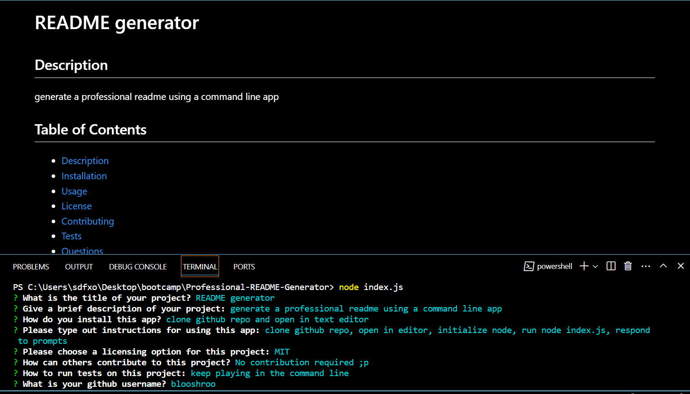

  # README Generator

  ## Description
  Use this app in the command line to generate a professional README file in moments.

  
  ## Table of Contents
  - [Description](#description)
  - [Installation](#installation)
  - [Usage](#usage)
  - [License](#license)
  - [Contributing](#contributing)
  - [Tests](#tests)
  - [Questions](#questions)
  

  ## Installation
  Clone this Github repo to your computer.

  ## Usage
  Clone Github repo, initialize node, run node index.js in the terminal, respond to prompts and voila! See your professional README generated in seconds.

  ## License
  This application is unlicensed.

  ## Contributing
  If you think of anything else this app could use, feel free to create a branch and push changes to the repo.

  ## Tests
  Play in the terminal all day long. 

  ## Video Overview
  

  ## Questions
  For questions about this project, please reach out to [blooshroo](https://github.com/blooshroo) or contact [trySmokeSignalling@fakeDomain.com](mailto:trySmokeSignalling@fakeDomain.com).
